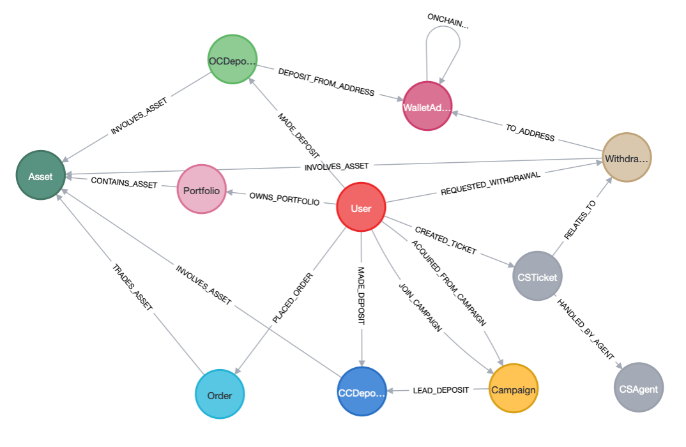

# Let LLM Think on Graph Schema Demo
This is a GenAI graph search Spring AI application written in Kotlin.


I use Customer 360 use case to prepare the sample graph data and schema.


## Get started
The demo default use Ollama `gemma2:9b` model which minimally need ~6GB GPU VRAM to run. 

### Setup Neo4j graph database locally (docker compose)
In `docker-compose.yml`, there is a default `NEO4J_AUTH` environment variable.
```bash
docker-compose up -d
```
### Inject sample graph data using Kotlin Notebook

### Step 1: Initialize gradle project
Open IntelliJ IDEA and open `build.gradle.kts` and click sync. This will automatically
download the project dependencies into your machine and be shared to Kotlin Notebook.
Or run CLI
```bash
./gradlew build
```

#### Step 2: Install Kotlin notebook plugin in IDE
In IntelliJ IDEA, go to Settings > Plugins, Search Kotlin Notebook plugin. Install and restart.


#### Step 3: Run notebook
Open `notebooks/neo4j.ipynb`. 

Click the play button to run notebook piece by piece. It should be able to connect and insert sample graph data.


### Setup local Ollama or using cloud GenAI service on Spring AI
```bash
brew install ollama

ollama pull gemma2:9b
```

### Run Spring Boot 
Use intelliJ IDEA to run Spring Boot or using the following CLI.
```bash
./gradlew bootRun
```

### Run Demo HTTP Request (app.http)
Open `app.http`, click the play button on the left to trigger 
http request to Spring Boot

Step by step to try the demo


Trace the output with prefix `[DEMO`


## Change to cloud LLM provider from Ollama
If you computer doesn't have GPU or insufficient of GPU VRAM. You can use
switch to [other cloud LLMs provider that supported by Spring AI](https://docs.spring.io/spring-ai/reference/api/chat/comparison.html).

### Step 1: Add other cloud LLM dependencies
Open `build.gradle.kts`, you can see the current dependency is using ollama
`org.springframework.ai:spring-ai-xxxxxxxxxx-spring-boot-starter`

Update your preferred LLM provider.

### Step 2: Modify model configuration
Open `src/main/kotlin/configs/MoodelConfiguration`, change the Ollama specific sources code to the new provider. 

Open `src/main/resources/application.properties`, add configuration according to [Spring AI documentation](https://docs.spring.io/spring-ai/reference/index.html).
